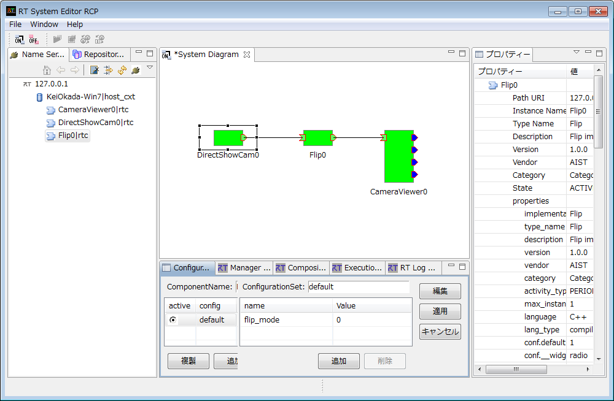

**(デモ 1) 画像処理 (OpenRTM-aist，OpenCV)**

.. contents::
.. sectnum::

.. raw:: html

   

Introduction
============

関連するチュートリアル
----------------------
- http://www.openrtm.org/openrtm/ja/node/4625
  - ネット接続不可の場合は ./doc/tutorial_openrtm_opencv_cmake_imgprocessing.pdf

このページで体験すること
------------------------
- カメラで認識する動画像を反転 (OpenRTM-aist，OpenCV による)
- `RT System Editor` の初歩的な利用法

動作環境
--------
- Windows 7／ 8
- Java Runtime Environment (JRE) 7 (`../misc/openjdk_1.7.0_u45_2.4.3_installed` として同梱，インストール不要)
- Internet Explorer (IE 以外のブラウザでは正常に動作しません) 

実行方法
========
以下，特に指定ない限り，配布 USB のホームディレクトリに居ることを前提とします．

nameserver 起動 (全チュートリアル共通)
--------------------------------------
基本的に `OpenRTM` の nameserver は一度起動すると，起動したままでもすべてのチュートリアルは動作すると思われます．

0) 次のリンクをクリックして nameserver を起動．

.. raw:: html

    <ul>
     <li><a class="reference external"  href="javascript:void(0)" onclick="call_rtmnamerserver(); return false;">rtm-naming.bat</a></li>
    </ul>

1) (上記方法でうまく行かなかった場合のみ以降実施) `Explorer` で `demo` フォルダを開き，`rtm-naming.bat` をダブルクリックして実行．

- `cmd.exe` (Command prompt) が開きっぱなしになり，次のような文言が表示されれば成功．::
    Starting omniNames for the first time.
    :
    Checkpointing completed.

2) 上記手順で `cmd.exe` が消えてしまう場合は，`nameserver` がうまく起動していないので次の手順で原因を発見：

  2.1) `Explorer` 上で，USB のドライヴ名を確認 (D/E/F etc. ここでは `F` と仮定)

  2.2) `cmd.exe` を手動起動 (Win 7: [4_], Win 8: [5_])

  2.3) 以下コマンドでフォルダ移動・コマンド実行::

    prompt> F:
    prompt> cd demo
    prompt> rtm-naming.bat

  エラー等発生していればここで表示されるのでその内容を診断．`OpenRTM` の `nameserver` の問題は WEB で検索して対処してみてください．

チュートリアルのプログラム実行
------------------------------

1) `./demo/OpencvRtmDemo/0_StartDemo.bat` を実行．次のリンクから起動できなければ，手動で `Explorer` から実行．

.. raw:: html

    <a class="reference external"  href="javascript:void(0)" onclick="callbat_relativepath('OpencvRtmDemo\\0_StartDemo.bat'); return false;">./demo/OpencvRtmDemo/0_StartDemo.bat</a>

2) ./demo/RTSE.bat を実行．

.. raw:: html

    <a class="reference external"  href="javascript:void(0)" onclick="call_rtseditor(); return false;">./demo/RTSE.bat</a>

RT System Editor が下図のように起動する．

.. image:: media/rtse_nocomponents.png

3) 左側のペインで 127.0.0.1 を選択し直上の右矢印をクリックすると，起動中の RT Component が同ペイン上に表示される．ここでは `DirectShowCamComp`，`FlipComp`，`CameraViewerComp` となるはず．

4) File --> Open New System Editor を選ぶと，`System Diagram` が真ん中のペインに開かれる．左側のペインから各 RTC を System Diagram にドラッグすると下図のように表示される．

.. image:: media/rtse_opencvflip_launched.png

5) 同ペイン上で各 RTC を接続．上に挙げた三つの RTC を左から接続する．

6) 同ペイン上で直上左にある "ALL" というアイコンをクリック，すべての RTC を activate (参考リンク 1_) 

9) `CaptureImage` というウィンドウにカメラ画像が表示されれば入出力・接続が成功．同時に `DirectShowCamComp` のコマンドプロンプトにも `frame rate` が定期的に追加表示される．

.. image:: media/1.1_framerate.png

10) `RTSystemEditor` 上で flip_mode の値を 1 --> 0 --> -1 と変える (Apply を忘れずに) とカメラ画像も変わることを確認できる．`flip_mode` の値と対応する挙動は次のようになる (画像引用元 2_)

.. image:: http://www.openrtm.org/openrtm/sites/default/files/1337/cvFlip_and_FlipRTC.png

11) 終了するには，次の手順で "RTC を inactivate" --> "RTC 間のリンクを切り離し" --> "各 RTC を停止" を行う．

- 同ペイン上で直上左にある "All Deactivate" というアイコンをクリック
- (5) で行ったのと逆を行う -- つまり，各接続線上で右クリックし"切断"を選択
- (1) で起動されたコマンドプロンプト群を手動で終了．ただし `rtm-naming.bat` のそれは停止せずとも良い．

ここで挙げた終了手順はやや煩雑ですが，御心配なく．次のチュートリアルからはこれらを一括して行うスクリプトを用意してあります．今回は初回なのでほぼすべてを手動で行い，`OpenRTM` のプログラム実行に必要な手順を体験して頂きました．

.. _1: http://www.openrtm.org/openrtm/ja/node/4625#toc26 
.. _2: http://www.openrtm.org/openrtm/sites/default/files/1337/cvFlip_and_FlipRTC.png
.. _3: http://www.oracle.com/technetwork/java/javase/downloads/java-se-jre-7-download-432155.html
.. _4: http://pcsupport.about.com/od/windows7/a/command-prompt-windows-7.htm
.. _5: http://pcsupport.about.com/od/windows-8/a/command-prompt-windows-8.htm
.. _rtm-naming.bat: ../demo/rtm-naming.bat
.. _StartDemo.bat: ../demo/OpencvRtmDemo/0_StartDemo.bat

----

Go back to `index <top.html>`__ | Go to `next <1.2_demo_mediaplaybyvoice.html>`__ |

Choose `Other language <index.html>`__
