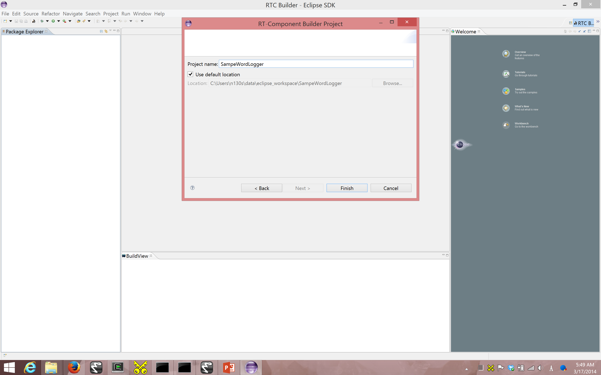
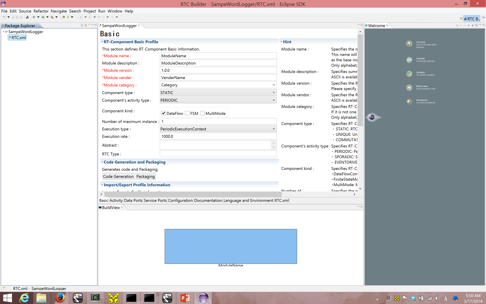
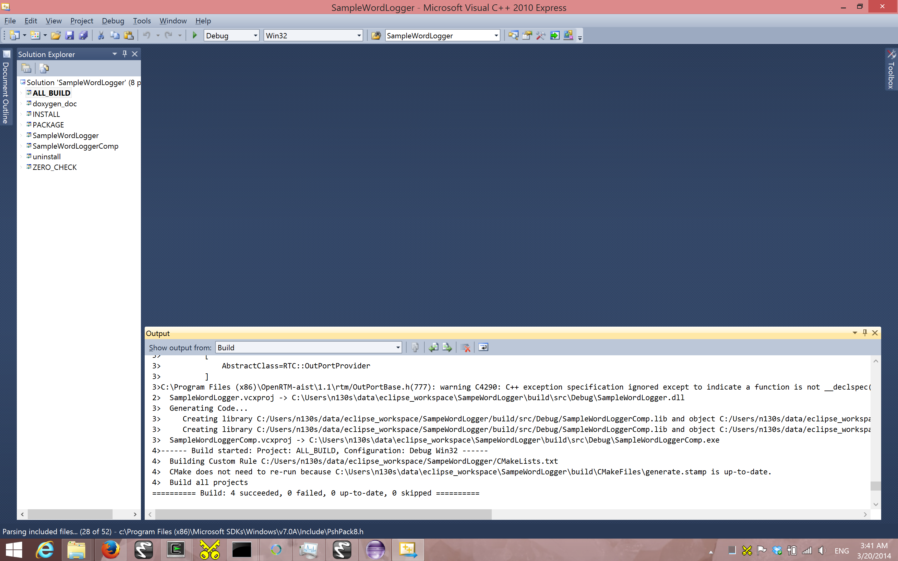

**(RTC 作成 1) 音声キーワードロガー RTC の開発**

.. contents::
.. sectnum::

============
Introduction
============

このページで体験すること
========================

- `OpenHRI` の RTC と接続することで，音声認識されたキーワードのログを取得し，時刻とともにファイルに保存する `SampleWordLogger RTC` の開発

関連するチュートリアル
======================
- `RTC` 作成の一般的作業の詳細は SampleWordLogger コンポーネントのチュートリアル[1_]に記述があります．特に `Eclipse` 上での GUI を利用した開発が説明されています．
  - なお本チュートリアル内で，[1_]内の多くの画像を参照しています．参照元はその都度記載しています．

SystemEnvironment
=================
- Windows 7 / 8
- Visual C++ 2010 (English [3_], Japanese [4_])
- `CMake` 2.8 (インストーラが同梱されています ./misc/installer/cmake-2.8.8-win32-x86.exe)
- `RTCBuilder` 1.1 (bundled in Eclipse [5_])

===============================
RTC の仕様 (I/O, Configuration)
===============================

これから作成するコンポーネントを SampleWordLogger RTC と呼ぶことにします．

このコンポーネントは `TimedString` 型の入力ポート (`InPort`) を持ちます．今回はログをファイルへ出力するのみとし，`RTC` として出力ポート (`OutPort`) は持たないｋとにします．`InPort` 名を `result` とします．

ログファイルの場所は今回はハードコードします (お好みに変えて下さい)．

上から RTC の仕様を次のようにまとめます．

+----------------+--------------------+
| Component Name | SampleWordLogger   |
+================+====================+
|              InPort                 |
+----------------+--------------------+
|Port Name       | result             |
+----------------+--------------------+
|Data Type       | TimedString        |
+----------------+--------------------+
|              OutPort                |
+----------------+--------------------+
|Port Name       | (None)             |
+----------------+--------------------+
|Data Type       | (None)             |
+----------------+--------------------+
|              Configuration          |
+----------------+--------------------+
|Parameter Name  | (None)             |
+----------------+--------------------+
|Data Type       | (None)             |
+----------------+--------------------+
|Values          | (None)             |
+----------------+--------------------+

===============================
RTCBuilder のインストール，起動
===============================
本章では `Eclipse` ベースのツール `OpenRTP (Open RT Platform)` に同梱される `RTBuilder` を利用するので，[2_]からダウンロード・インストールして下さい．

新規ワークスペースを指定して Eclipse を起動すると，以下のような Welcome ページが表示されます (`画像引用元 <http://www.openrtm.org/openrtm/sites/default/files/1028/fig1-1EclipseInit.png>`__)．

.. image:: http://www.openrtm.org/openrtm/sites/default/files/1028/fig1-1EclipseInit.png

Welcome ページはいまは必要ないので左上の「×」ボタンを押して閉じてください (`画像引用元 <http://www.openrtm.org/openrtm/sites/default/files/1028/fig2-2PerspectiveSwitch.png>`__)．

.. image:: http://www.openrtm.org/openrtm/sites/default/files/1028/fig2-2PerspectiveSwitch.png

右上の「Open Perspective」ボタンを押下し，プルダウンの「Other…」 ボタンを押下します(`画像引用元 <http://www.openrtm.org/openrtm/sites/default/files/208/fig2-3PerspectiveSelection.png>`__)．

.. image:: http://www.openrtm.org/openrtm/sites/default/files/208/fig2-3PerspectiveSelection.png

`RTC Builder` を選択することで，RTCBuilder が起動します．

===============
How to make RTC
===============

新規プロジェクトの作成
======================
SampleWordLogger コンポーネントを作成するために，`RTCBuilder` で新規プロジェクトを 作成する必要が有ります．画面上部のメニューから[ファイル]－[新規]－ [プロジェクト]を選択します．

.. image:: media/rtb_new_prj.png

表示された ｢新規プロジェクト｣ 画面において，｢その他｣－｢RTCビルダ｣ を選択し，｢次へ｣ をクリックします．｢プロジェクト名｣欄に作成するプロジェクト名 (ここでは SampleWordLogger) を入力して｢終了｣をクリックします． 

指定した名称のプロジェクトが生成され，パッケージエクスプローラ内に追加されます． 生成したプロジェクト内には，デフォルト値が設定された RTC プロファ イル XML(RTC.xml) が自動的に生成されるのがわかると思います．

`RTC.xml` が生成された時点で，このプロジェクトに関連付けられているワークスペースとして `RTCBuilder` のエディタが開くはずです．もし開かない場合は，ツールバーの｢Open New RtcBuilder Editor｣ボタンを押下するか，メニューバーの [file]-[Open New Builder Editor] を選択します． 

.. image:: media/rtb_button_open_rtbeditor.png

(`画像引用元 <http://www.openrtm.org/openrtm/sites/default/files/1028/fig2-10FileMenuOpenNewBuilder.png>`__)．

.. image:: http://www.openrtm.org/openrtm/sites/default/files/1028/fig2-10FileMenuOpenNewBuilder.png

SampleWordLogger コンポーネントの雛型の生成
===========================================

SampleWordLogger RTC の雛型の生成は，`OpenRTP` に同梱の `RTCBuilder` を用いて行います．

プロファイル情報入力とコードの生成
----------------------------------
まず，いちばん左の「基本」タブを選択し，基本情報を入力します．先ほ ど決めた SampleWordLogger コンポーネントの仕様(名前)の他に，概要やバージョン等を入力してください．ラベルが赤字の項目は必須項目です．その他はデフォルトで構いません．

.. image:: media/rtb_logger_componentinfo.png

次に，「アクティビティ」タブを選択し，使用するアクションコールバッ クを指定します．
`SampleWordLogger RTC` では，onActivated(), onDeactivated(), onExecute() コールバックを使用します．下図のように (1) の onAtivated をクリック後に (2) のラジオボタンにて "on" にチェックを入れます．onDeactivated, onExecute についても同様の手順を行います(`画像引用元 <http://www.openrtm.org/openrtm/sites/default/files/1431/Activity.png>`__)．

.. image:: http://www.openrtm.org/openrtm/sites/default/files/1431/Activity.png

さらに，"Data Ports" タブを選択し，データポートの情報を入力します． 先ほど決めた仕様を元に以下のように入力します．なお，変数名や表示位置はオプションで，そのままで結構です．

.. image:: media/rtb_logger_dataport.png

次に，「言語・環境」タブを選択し，プログラミング言語を選択します． ここでは，`C++` を選択します．なお，言語・環境はデフォルト等が 設定されておらず，指定し忘れるとコード生成時にエラーになりますので， 必ず言語の指定を行うようにしてください．

また，`C++` の場合デフォルトでは `CMake` を利用してビルドすることになって いますが，旧式の `VC` のプロジェクトやソリューションを直接 `RTCBuilder` が 生成する方法を利用したい場合は `Use old build environment` を チェックしてください． 

最後に，「基本」タブにある"コード生成"ボタンをクリックし，コンポー ネントの雛型を生成します．

※ 生成されるコード群は，eclipse 起動時に指定したワークスペースフォルダの中に生成されます．現在のワークスペースは，「ファイル(F)」 > 「ワークスペースの切り替え(W)...」で確認することができます．

仮ビルド
========

さて，ここまでで SampleWordLogger コンポーネントのソースコードが生成されました． 処理の中身は実装されていないので，`InPort` に他の `RTC` を接続しても何も出力されませんが，生成直後のソースコードだけでもコンパイルおよび実行はできます．

※サービスポートとプロバイダを持つコンポーネントの場合，実装を行わないとビルドが通らないものもあります．

では，まず `CMake` を利用してビルド環境の `Configure` を行います．Linuxで あれば，SampleWordLogger コンポーネントのソースが生成されたディレクトリで::

    $ cmake .
    $ make

とすれば，Configureおよびビルドが完了するはずです．`Windows` の場合は GUI を利用して `Configure` してみます． スタートメニューなどから `CMake (cmake-gui)` を起動します(`画像引用元 <http://www.openrtm.org/openrtm/sites/default/files/4625/CMakeGUI0.png>`__)．

.. image:: http://www.openrtm.org/openrtm/sites/default/files/4625/CMakeGUI0.png

画面上部に以下のようなテキストボックスがありますので，それぞれソースコードの場所(`CMakeList.txt` が有る場所) と，ビルドディレクトリを指定します．

    Where is the soruce code ^ Where to build the binaries

ソースコードの場所は SampleWordLogger コンポーネントのソースが生成された場所で `CMakeList.txt` が存在するディレクトリです．デフォルトでは <ワークス ペースディレクトリ>/SampleWordLogger になります．

また，ビルドディレクトリとは，ビルドするためのプロジェクトファイルやオブジェクトファイル，バイナリを格納する場所のことです．場所は任意ですが，この場合 <ワークスペースディレクトリ>/SampleWordLogger/build のように分かりやすい名前をつけた SampleWordLogger のサブディレクトリを指定することをお勧めします．

.. image:: media/logger_cmake_1.png

指定したら，下の `Configure` ボタンを押します．すると下図のようなダイアログが表示されますので，生成したいプロジェクトの種類を指定します．今回は `Visual Studio 10` とします(`画像引用元 <http://www.openrtm.org/openrtm/sites/default/files/4625/CMakeGUI1.png>`__)．

.. image:: http://www.openrtm.org/openrtm/sites/default/files/4625/CMakeGUI1.png

ダイアログで Finish を押すと Configure が始まります．問題がなければ下部のログウインドウに Configuring done と出力されますので，続けて Generate ボタンを押します．Generating done と出ればプロジェクトファイル・ソリューションファイル等の出力が完了します．

なお，`CMake` は Configure の段階でキャッシュファイルを生成しますので，トラブルなどで設定を変更したり環境を変更した場合は [File]-[Delete Cache] でキャッシュを削除して `Configure` からやり直してください．

次に先ほど指定した `build` ディレクトリの中の SampleWordLogger.sln をダブルクリックして `Visual Studio 2010` を起動します．

起動後，ソリューションエクスプローラーの `ALL_BUILD` を右クリックしビルドを選択してビルドします．特に問題がなければ正常にビルドが終了します．

ここで `VC++ 2010` は閉じても構いません．

ヘッダ，ソースの編集
====================

アクティビティ処理の実装
------------------------
SampleWordLogger RTC では，InPort から語を受け取った時刻とその語をファイルストリームに流します．

`onActivated()`, `onExecute()`, `onDeactivated()` での処理内容を下図に示します (`編集用の図ファイル <https://docs.google.com/drawings/d/19KHmLRoOhHJVumNMwcO7CrPV7lWUwmFB3CD5OfT6mIo/edit>`__ 必要であれば編集権を同ページ内から申請して下さい)．

.. image:: https://docs.google.com/drawings/d/19KHmLRoOhHJVumNMwcO7CrPV7lWUwmFB3CD5OfT6mIo/pub?w=960&amp;h=720

.cpp ファイル編集
------------------------

下記のように，`onActivated()`, `onDeactivated()`, `onExecute()` を実装します．::

    RTC::ReturnCode_t SampleWordLogger::onActivated(RTC::UniqueId ec_id)
    {
      // open file
      std::cerr << "Opening Log File ... " << m_SampleWordLoggerFileName << std::endl;
      std::locale::global(std::locale(""));
      m_SampleWordFileStream.open(m_SampleWordLoggerFileName);
      if(!m_SampleWordFileStream) {
          std::cerr<<"Error opening file"<< std::endl; 
    	  return RTC::RTC_ERROR;
      }
    
      m_SampleWordFileStream.imbue(std::locale(m_SampleWordFileStream.getloc(),new std::codecvt_utf8_utf16<wchar_t>));
    
      return RTC::RTC_OK;
    }
    
    RTC::ReturnCode_t SampleWordLogger::onDeactivated(RTC::UniqueId ec_id)
    {
      // close file
      m_SampleWordFileStream.close();
    
      return RTC::RTC_OK;
    }
    
    RTC::ReturnCode_t SampleWordLogger::onExecute(RTC::UniqueId ec_id)
    {
       // Check if the inbound data is new.
       if (m_resultIn.isNew()) {
         // Read in from InPort.
         m_resultIn.read();
     
    	 //
    	 SYSTEMTIME systime;
    	 GetLocalTime(&systime);
    	 static char sDate[128];
    	 sprintf(sDate, "%04d/%02d/%02d %02d:%02d:%02d", systime.wYear, systime.wMonth, systime.wDay, systime.wHour, systime.wMinute, systime.wSecond);
    	 std::cerr << "Writing... " << std::endl; 
    	 std::cerr << "    " << sDate << std::endl;
    	 m_SampleWordFileStream << sDate << " ";
    
    	 HRESULT hr = S_OK;
    	 IXmlReader *pReader = NULL;
         XmlNodeType nodeType;
    	 IStream *pStream;
    	 CreateStreamOnHGlobal(NULL, TRUE, &pStream);
    	 LARGE_INTEGER liBeggining = { 0 };
    	 pStream->Seek(liBeggining, STREAM_SEEK_SET, NULL);
    	 ULONG ulBytesWritten = 0;
    	 ULONG ulSize = 0;
    	 ULARGE_INTEGER uliSize = { 0 };
    	 pStream -> SetSize (uliSize);
    	 ulSize = (ULONG)strlen(m_result.data);
    	 pStream->Write((void const*)m_result.data,(ULONG)ulSize, (ULONG*)&ulBytesWritten);
    	 pStream->Seek(liBeggining, STREAM_SEEK_SET, NULL);
    
    	 if (FAILED(hr = CreateXmlReader(__uuidof(IXmlReader), (void**) &pReader, NULL)))
    	 {
            wprintf(L"Error creating xml reader, error is %08.8lx", hr);
    		return RTC::RTC_ERROR;
    	 }
    	 
    	 if (FAILED(hr = pReader->SetProperty(XmlReaderProperty_DtdProcessing, DtdProcessing_Prohibit)))
    	 {
            wprintf(L"Error setting XmlReaderProperty_DtdProcessing, error is %08.8lx", hr);
    		return RTC::RTC_ERROR;
    	 }
    	 
    	 if (FAILED(hr = pReader->SetInput(pStream)))
    	 {
            wprintf(L"Error setting input for reader, error is %08.8lx", hr);
            return RTC::RTC_ERROR;
    	 }
    
    
    	 bool firstText = true;
    	 while (S_OK == (hr = pReader->Read(&nodeType)))
    	 {
            LPCWSTR pwszPrefix = NULL;
            UINT cwchPrefix = 0;
            LPCWSTR pwszLocalName = NULL;
            LPCWSTR pwszValue = NULL;
    
    		switch (nodeType)
    		{
    		case XmlNodeType_Element:
    			if (FAILED(hr = pReader->GetPrefix(&pwszPrefix, &cwchPrefix)))
    			{
    				wprintf(L"Error getting prefix, error is %08.8lx", hr);
    				return RTC::RTC_ERROR;
    			}
    			if (FAILED(hr = pReader->GetLocalName(&pwszLocalName, NULL)))
    			{
    				 wprintf(L"Error getting local name, error is %08.8lx", hr);
    				 return RTC::RTC_ERROR;
    		    }
    			if (cwchPrefix > 0)
    				wprintf(L"Element: %s:%s\n", pwszPrefix, pwszLocalName);
    			else
    				wprintf(L"Element: %s\n", pwszLocalName);
    
    			// Attributes
    			const WCHAR* pwszPrefix;
    			const WCHAR* pwszLocalName;
    			const WCHAR* pwszValue;
    			hr = pReader->MoveToFirstAttribute();
    			while (TRUE)
    			{
    				if (!pReader->IsDefault())
    				{
    					UINT cwchPrefix;
    					if (FAILED(hr = pReader->GetPrefix(&pwszPrefix, &cwchPrefix)))
    					{
    						wprintf(L"Error getting prefix, error is %08.8lx", hr);
    						return RTC::RTC_ERROR;
    					}
    					if (FAILED(hr = pReader->GetLocalName(&pwszLocalName, NULL)))
    					{
    						wprintf(L"Error getting local name, error is %08.8lx", hr);
    						return RTC::RTC_ERROR;
    					}
    					if (FAILED(hr = pReader->GetValue(&pwszValue, NULL)))
    					{
    						wprintf(L"Error getting value, error is %08.8lx", hr);
    						return RTC::RTC_ERROR;
    					}
    					if (cwchPrefix > 0)
    						wprintf(L"Attr: %s:%s=\"%s\" \n", pwszPrefix, pwszLocalName, pwszValue);
    					else
    						wprintf(L"Attr: %s=\"%s\" \n", pwszLocalName, pwszValue);
    					
    					if ( firstText && wcscmp(pwszLocalName, L"text") == 0 ) {
    						m_SampleWordFileStream << pwszValue << std::endl;
    						firstText = false;
    					}
    					//m_SampleWordFileStream << "  " <<  pwszLocalName << ":" << pwszValue << std::endl;
    				}
    
    				if (S_OK != pReader->MoveToNextAttribute())
    					break;
    			}
    
    			if (pReader->IsEmptyElement() )
    				wprintf(L" (empty)");
    			 break;
    		 case XmlNodeType_EndElement:
    			 if (FAILED(hr = pReader->GetPrefix(&pwszPrefix, &cwchPrefix)))
    			 {
    				wprintf(L"Error getting prefix, error is %08.8lx", hr);
    				return RTC::RTC_ERROR;
    		     }
    			 if (FAILED(hr = pReader->GetLocalName(&pwszLocalName, NULL)))
    			 {
    				wprintf(L"Error getting local name, error is %08.8lx", hr);
    				return RTC::RTC_ERROR;
    			 }
    			 if (cwchPrefix > 0)
    				wprintf(L"End Element: %s:%s\n", pwszPrefix, pwszLocalName);
    			 else
    				wprintf(L"End Element: %s\n", pwszLocalName);
    			 break;
    		}
    	 }       
    	//
       }
       return RTC::RTC_OK;
    }

CMakeList.txt の編集
========================================

この RTC ではログファイル生成のために `xmllib` を使用しています (実際のログのフォーマットは xml ではありませんが) ので，`RTCBuilder` が生成した `CMakeLists.txt` にその旨を追記します．

適当なエディタ (`VC++ 2010, Emacs` 等) 上で，`SampleWordLogger/CMakeLists.txt` を開いて下さい．::

    add_subdirectory(src)

とあり，`src` フォルダの情報は移譲されていることが分かるので，`SampleWordLogger/src/CMakeLists.txt` を開きます．このファイル中を例えば以下の様に変更します::

    + # Add xmllibs that's necessary for this SampleWordLogger project
    + set(REQ_LIBS xmllite.dll)
    
      add_library(${PROJECT_NAME} ${LIB_TYPE} ${comp_srcs}
        ${comp_headers} ${ALL_IDL_SRCS})
      set_target_properties(${PROJECT_NAME} PROPERTIES PREFIX "")
      set_source_files_properties(${ALL_IDL_SRCS} PROPERTIES GENERATED 1)
      add_dependencies(${PROJECT_NAME} ALL_IDL_TGT)
    - target_link_libraries(${PROJECT_NAME} ${OPENRTM_LIBRARIES})
    + target_link_libraries(${PROJECT_NAME} ${OPENRTM_LIBRARIES} ${REQ_LIBS})
    
      add_executable(${PROJECT_NAME}Comp ${standalone_srcs}
        ${comp_srcs} ${comp_headers} ${ALL_IDL_SRCS})
    - target_link_libraries(${PROJECT_NAME}Comp ${OPENRTM_LIBRARIES})
    + target_link_libraries(${PROJECT_NAME}Comp ${OPENRTM_LIBRARIES} ${REQ_LIBS})

VC++ によるビルド
=================
Visual C++ 2010 に戻ります．もし既に閉じていれば，再度 `SampleWordLogger.sln` ファイルをダブルクリックし，Visual C++ 2010 を起動します．Visual C++ 2010 の起動後，下図のようにし，コンポーネントのビルドを行います(`画像引用元 <http://www.openrtm.org/openrtm/sites/default/files/1028/VC++_build.png>`__)．

.. image:: http://www.openrtm.org/openrtm/sites/default/files/1028/VC++_build.png

Visual C++ 2010 のコンソールにエラーが起きたと表示されなければ，以上で RTC 作成が終了です．

========
実行方法
========
以下，特に指定ない限り，配布 USB のホームディレクトリに居ることを前提とします．

では実行してみましょう．
`SampleWordLogger` は単体だと何も行わないので，先に紹介された `MotionByVoiceDemo` と組合せて発話を記録してみましょう．

上記二つのフォルダからそれぞれに格納される RTC を呼ぶための .bat ファイルを既に `./demo/MotionByVoiceLoggerDemo` として用意してあります．

1) `./demo/MotionByVoiceLoggerDemo` から "0 StartDemo.bat_"，"1 ConnectRTC.bat_"，"2 ActivateRTC.bat_" をそれぞれ実行．RT System Editor で見てみると，`SampleWordLogger` の RTC も実行されているのが確認可能．

.. image:: media/rtse_motionvoicelogger_activated.png

2) `MotionByVoiceDemo のチュートリアル <1.4_callmotion_byvoice.htm#HowToRun>`__ に従い，発話デモを実行．

3) 3 から 5 までの `.bat` ファイルを実行し，RT システムを停止する．

4) `./demo/SampleWordLogger/build/Debug/SampleWord.log` をテキストエディタで開くと，下の例のように，時刻と発話内容が記録されている．

    2014/03/13 08:56:31 左 さげて
    2014/03/13 08:56:44 右 あげて
    2014/03/13 08:57:08 左 よろしく
    2014/03/13 08:58:23 左 あげて
    2014/03/13 08:58:39 左 あげない

6) 終了時は，"3 DeactivateRTC.bat_", "4 DisconnectRTC.bat_"，"5 DemoExit.bat_" の順に実行．

.. _1: http://www.openrtm.org/openrtm/ja/node/4625#toc7
.. _2: http://openrtm.org/openrtm/ja/download/openrtp/openrtp-110-rc4-ja#toc1
.. _3: http://www.visualstudio.com/downloads/download-visual-studio-vs#DownloadFamilies_4
.. _4: http://go.microsoft.com/fwlink/?LinkId=190491&clcid=0x411
.. _5: http://openrtp.jp/wiki/attachments/_default/Home/iRex2011/eclipse342_rtmtools110-rc2_win32_ja.zip/download
.. _StartDemo.bat: ../demo/MotionByVoiceLoggerDemo/0%20StartDemo.bat
.. _ConnectRTC.bat: ../demo/MotionByVoiceLoggerDemo/1%20ConnectRTC.bat
.. _ActivateRTC.bat: ../demo/MotionByVoiceLoggerDemo/2%20ActivateRTC.bat
.. _DeactivateRTC.bat: ../demo/MotionByVoiceLoggerDemo/3%20DeactivateRTC.bat
.. _DisconnectRTC.bat: ../demo/MotionByVoiceLoggerDemo/4%20DisconnectRTC.bat
.. _DemoExit.bat: ../demo/MotionByVoiceLoggerDemo/5%20DemoExit.bat

